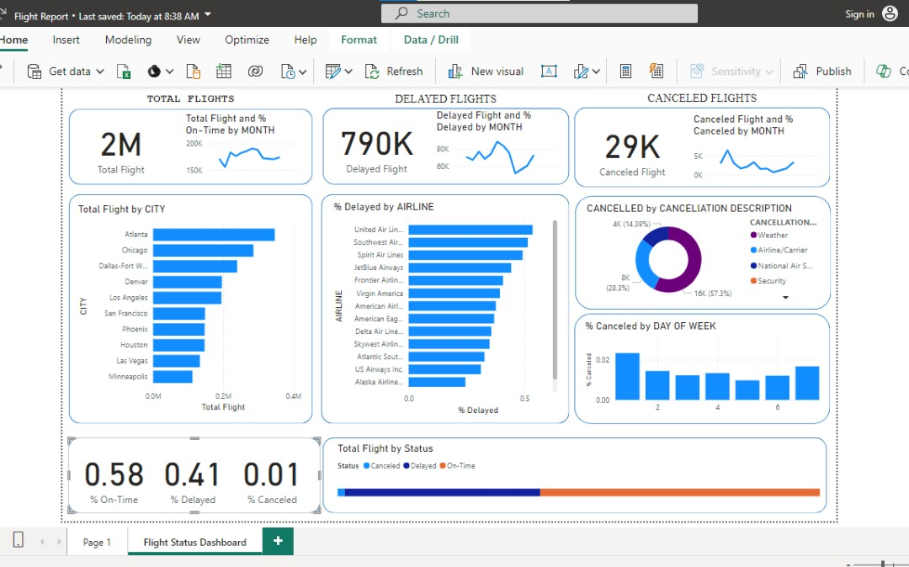
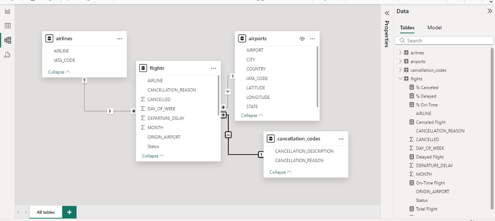
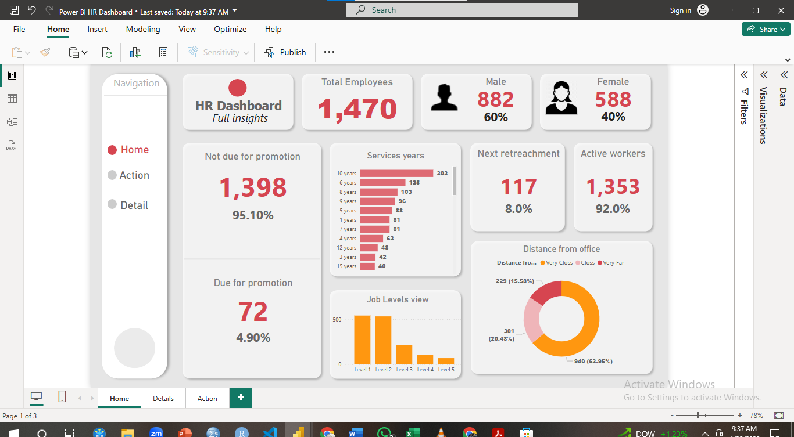
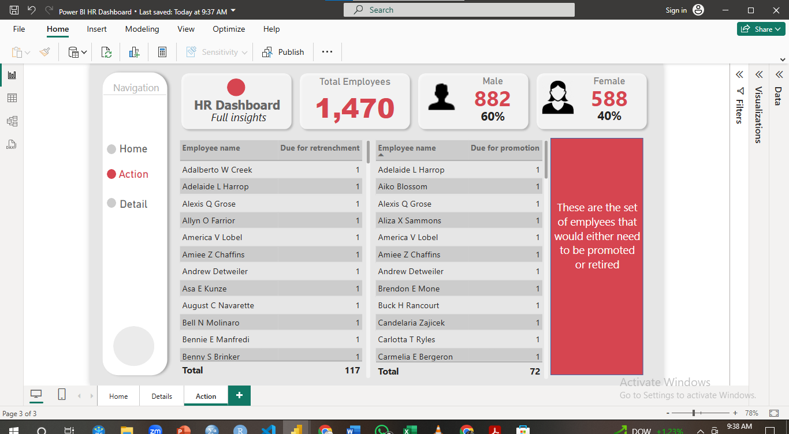
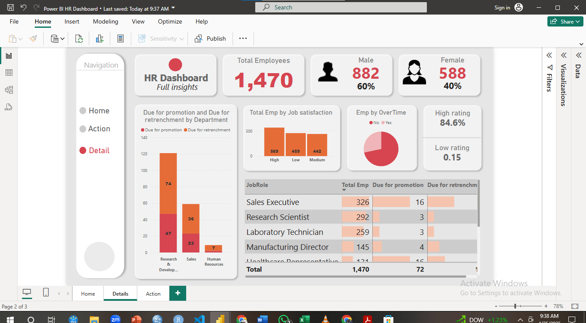
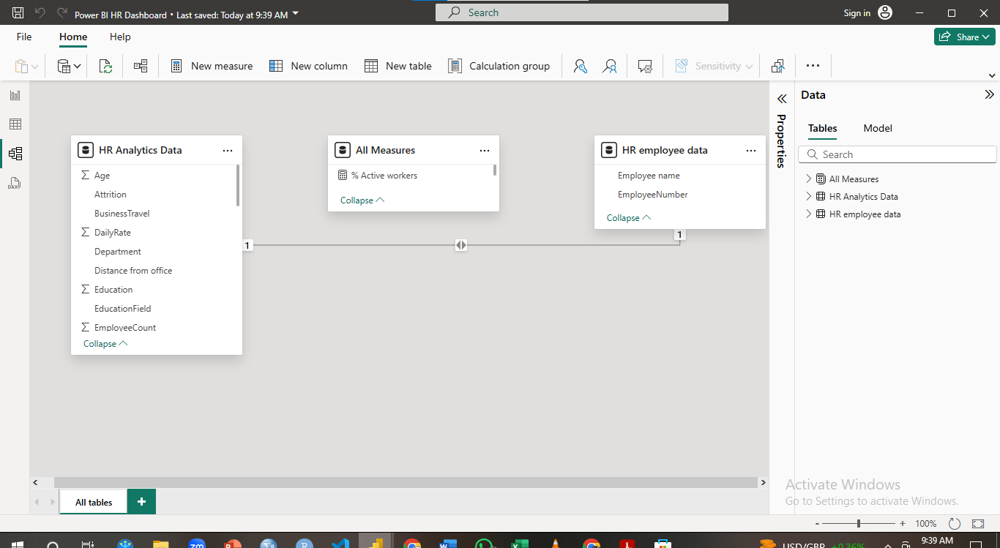
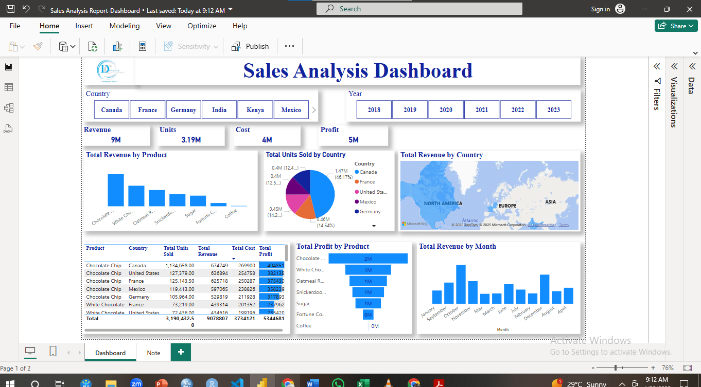
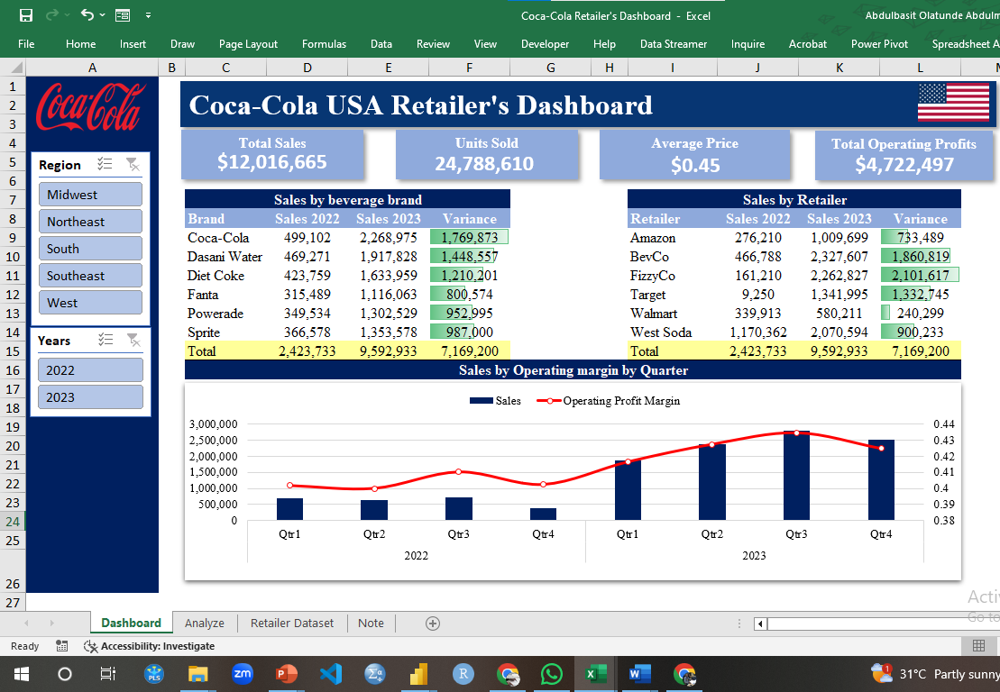

<!--Section 1: Introduce your self-->
## ABOUT ME

Hi!, I'm AA Olatunde 😊, a Business Intelligence Analyst, Research Analyst, Statistician, Educator, and Consultant passionate about transforming data into actionable insights. With expertise spanning sales, operations, finance, and customer service, I help businesses tackle challenges and drive growth.

<!--Mention your top/relevant skills here - core and soft skills-->
## WHAT I DO
As the NOC COORDINATOR with Power BI at IENGINEERING GROUP, my responsibilities include:  
- Monitoring network performance and site availability in real time to ensure continuous and reliable service delivery.
- Coordinating incident detection, logging, escalation, and resolution in collaboration with field engineers, vendors, and internal teams.
- Developing and maintaining Power BI dashboards that visualize outages, SLA performance, MTTR, alarms, and other key operational KPIs.
- Ensuring seamless access to accurate operational data by integrating multiple data sources and maintaining data integrity within BI reports.
- Responding promptly to operational inquiries and providing timely updates during outage events to support effective communication.
- Identifying recurring network issues through data analysis and recommending strategies to enhance network stability and minimize downtime.
- Facilitating cross-functional collaboration between the energy, transmission, engineering, and operations teams to improve workflow and service delivery.
- Preparing daily, weekly, and monthly operational performance reports for management and clients to support data-driven decisions.
- Analyzing outage trends, alarm patterns, and power-related operational data to generate insights that drive proactive network management.

As the Business Intelligence Analyst at Nigerian Beverages, my responsibilities include:  
- Developing reporting and analytics to support sales activities while providing strategic recommendations to enhance the sales process.  
- Ensuring seamless access to stored data for both internal and external teams.  
- Responding promptly to staff inquiries and information requests.  
- Assisting in the creation of strategies aimed at expanding the company’s customer base.  
- Identifying opportunities for cross-functional collaboration.  
- Building strong internal relationships to align with business objectives.  
- Researching, developing, refining, and implementing data collection processes.  
- Preparing daily, weekly, and monthly one-page reports for management, offering data-driven insights for decision-making.  
- Analyzing market data to identify patterns and trends.

As the Research Analyst at TechMentor Africa and Crownstar Data Analytics, I provide consulting and training services for businesses and mentor aspiring analysts by tutoring :
-Introduction to Research Methodologies
- Research Design and Data Collection Methods
- Descriptive Statistics and Data Visualization
- Probability and Distributions
- Hypothesis Testing and Inferential Statistics
- Correlation and Regression Analysis
- Reporting and Presenting Research Findings
Using Statistical Software and Tools like Microsoft office tools, Google forms, SPSS, and R programming language.
 
**- ✅ Data Analytics Consulting.**
I deliver comprehensive data analysis and customized solutions designed to empower informed decision-making, streamline operations, and enhance overall business performance, ensuring sustainable growth and competitive advantage.

**- ✅ Staff Training & Development.**
I provide comprehensive training programs covering data analysis, visualization, and data-driven decision-making, tailored for all skill levels—from beginners looking to build a strong foundation to advanced learners seeking to refine their expertise. 

<!--Section 2: List 3-4 key projects-->
## MY PORTFOLIO 

*A brief look at some of the exciting projects I’ve been working on.*

**Power BI Projects: Business Analysis of the Flight Status report, HR Analytics, and Sales Dashboard.**

**The Modeling Phase**

[Read More](<a href="Flight Report.pbix">Download the full Report here (pdf file)</a>)

**HR Data Analysis**

[Read More](<a href="Power BI HR Dashboard.pbix">Download the full Report here (pdf file)</a>)

**Sales Analysis**

[Read More](<a href="Sales Analysis Report-Dashboard.pbix">Download the full Report here (pdf file)</a>)

**Predictive Modeling and Hypothesis Testing using The Pregnancy Termination Dataset.**

The results of the Logistic regression analysis reveal several significant predictors of pregnancy termination in Northern and Southern parts of Nigeria.

[Read More](<a href="The Influence of Pregnancy Termination in Nigeria.pdf">Download the full Report here (pdf file)</a>)

[Read More](https:Interactive and dynamic Dashboard r)

**MS Excel Projects: Sales Dashboard using the Coca-Cola retailer dataset.**

Fortunately, there was a massive year-over-year growth: Sales rose from $2.42M in 2022 to $12.02M in 2023 (~397% increase). 

<a href="Coca-Cola Retailer Dashboard.xlsx">Download full Report here (Excel file)</a>

<a href="https://drive.google.com/drive/folders/1eGbgcNavmiDxlyerbJWVGMeHBNALq8aC?usp=drive_link">Click here for more exciting Reports </a>
## CONTACT DETAILS

*Let’s connect and explore how we can create a meaningful impact together!*
<table>
  <tbody>
    <tr>
      <td>📧</td>
      <td><a href="mailto: abdulbasitabdulmumin0@gmail.com">Email Us here</a></td>
    </tr>
    <tr>
      <td>📞</td>
      <td>(234) 810-379-4994</td>
    </tr>
    <tr>
      <td>📍</td>
      <td>Lagos, Nigeria</td>
    </tr>
    <tr>
      <td>⬇️</td>
      <td><a href="ABDULMUMIN Abdulbasit Olatunde - Resume.pdf">Download my CV</a></td>
    </tr>
    <tr>
      <td>🌐</td>
      <td><a href="https://www.linkedin.com/in/abdulbasit-abdulmumin8110567538">The things I do daily on LinkedIn</a></td>
    </tr>
    <tr>
      <td>📺</td>
      <td><a href="#">Back to the top</a></td>
    </tr>
  </tbody>
</table>

   

**Displaying Raw File by Crownstar Data Analytics.**
